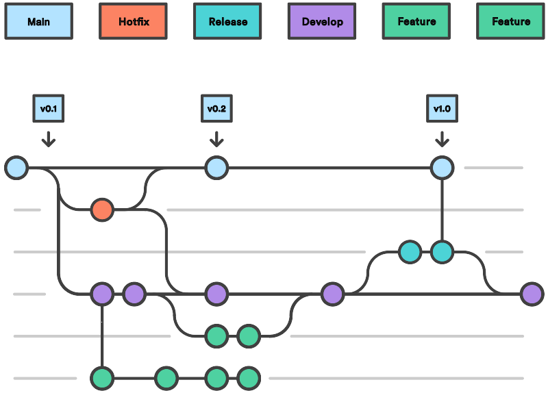
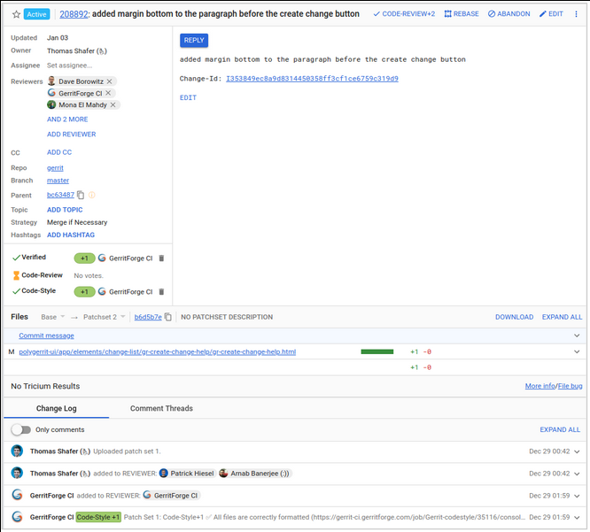
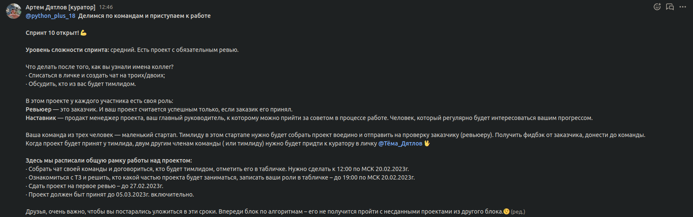

# Continuous Integration

Все пушат прямо в *master* (*main*)  

```sh
git clone ssh://user@host/path/to/repo
git add <some-file>
git commit
git push origin main
```

Важно всегда работать с последней версией *master* (*main*) чтобы не было конфликтов.  

```sh
git pull
# vi /path/to/file
git add /path/to/file
git commit && git push origin main
```


# pull rebase


##  

Используя *rebase* во время *pull* вы не будете создавать дополнительный merge-коммит.  

```sh
git pull --rebase origin main
```


##  

Или настроить автоматический ребейз  

```sh
git config pull.rebase true
```


# Разрешение конфликтов

```sh
git status
# редактируете файлы с конфликтами
git add <file>
git rebase --continue
```


# Git Feature Branch Workflow

Для каждой новой *фичи* или задачи создаётся новая ветка. Затем ветка сливается в основной код в *master* (*main*)  

```sh
git checkout -b features/feature-xxx
# редактируем код
git add <files>
git commit
git push -u origin features/feature-xxx
```


# Правила работы с ветками


## Должно быть общее правило именования feature веток.

> feature/<feature\_name>  

> task/<task-ID>  


# Правила работы с ветками


## Всегда начинайте feature ветку от текущего состояния основной ветки.

```sh
git pull  # git pull --rebase
git branch -b feature/<feature_name>
```


# Правила работы с ветками


## Перед созданием PR вливайте изменения из основной ветки. Все конфликты должны быть решены в вашей ветке!

```sh
git fetch origin main
git rebase
```


# Правила работы с ветками


## Долгоживущие feature ветки зло.

Держите не более 1-2 дней. Для этого четко описывайте задачу, которую хотите решить в ветке.  


# Правила работы с ветками


## Пишите тесты на свой код!

После разрешения конфликтов слияния они вам здорово помогут.  


# GitFlow

-   Данная модель отлично подходит для организации рабочего процесса на основе релизов.
-   Работа по модели Gitflow предусматривает создание специальной ветки для исправления ошибок в рабочем релизе.

  


# Правила работы с GitFlow

1.  Релизная ветка (master, main, trunk).  
    -   Всегда стабильна, готова к работе в любой момент времени.
    -   Работают только лиды/синьоры.
    -   Изменения только через Pull Request (PR) из develop или hot-fix веток.
2.  Основная ветка разработки (develop).  
    -   Допускается краткосрочная неработоспособность.
    -   Работает вся команда.
    -   Изменения напрямую или через PR из функциональных веток.
3.  Функциональные ветки (feature/<name>), они же фича ветки.  
    -   Под каждого разработчика/фичу.
    -   Изменения напрямую.
    -   Порождается от develop ветки.


# Gerrit

Gerrit это надстройка над GIT сервером. Он дополнительно даёт вам  

-   Code Review
-   Контроль доступа к бранчам
-   История правок не засоряет log

  


# Gerrit UI

  


# Литература

-   [GIT Concepts and Workflows](https://github.com/pimiento/colaborate_webinar/blob/master/GIT_concepts_and_workflows.pdf)
-   [GIT branches](https://learngitbranching.js.org/)
-   [GIT workflows](https://www.atlassian.com/ru/git/tutorials/comparing-workflows)
-   [GitHub flow](https://guides.github.com/introduction/flow/)
-   [Gerrit](https://docs.google.com/presentation/d/1C73UgQdzZDw0gzpaEqIC6SPujZJhqamyqO1XOHjH-uk/view#slide=id.g4d6c16487b_1_24)


# DevOps

-   Coding
-   Building
-   Testing
-   Deploying (packaging, releasing)


# Автоматизация DevOps

<div class="org-center">
<p>
<span class="underline"><span class="underline"><a href="https://www.jenkins.io/">Jenkins</a></span></span><br />
</p>
</div>

  


# Спринт 10: Командная работа

  


# Избегаем блокировок

1.  В первую очередь пишем модели БД.  
    -   Каждая модель в отдельном файле.
    -   Если модель для ForeignKey не существует, допустимо сделать *IntegerField*, затем заменить на *ForeignKey*.
2.  Если ваша ветка живет более 4-х часов, то вливайте изменения из основной ветки дважды в день. Все конфликты должны быть решены в вашей ветке!
3.  Поддерживайте тесную связь. Синхронизация Pull Request-ов, правок кода сильно ускорит работу над проектом. Задача лида быть всегда в курсе что происходит с проектом, кто над чем работает.


# Командные процессы

1.  Ежедневные встречи (daily meetings). Если нужна помощь в проведении, приглашайте наставников.
2.  Планирование в начале проекта и по необходимости в ходе работы.
3.  Совместная работа в трекере задач (Trello/Jira и т.п.).
4.  Команда обсуждает вопросы, по которым требуется помощь и делегирует лиду обсуждение этих вопросов с наставником.


# Вопросы-ответы


